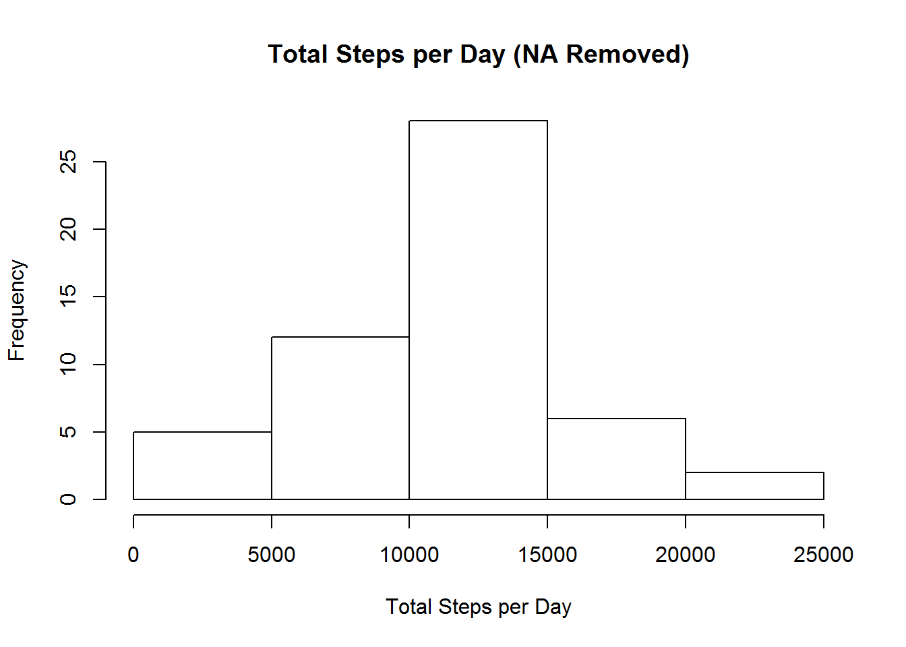
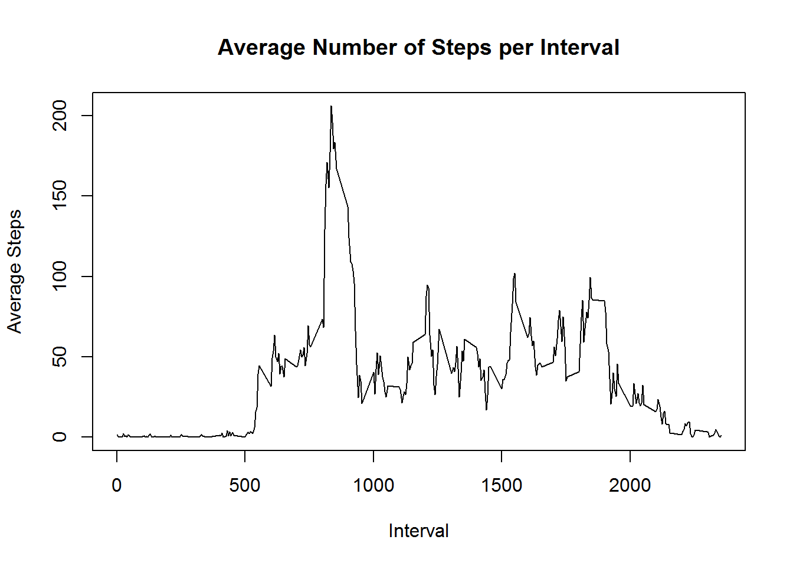
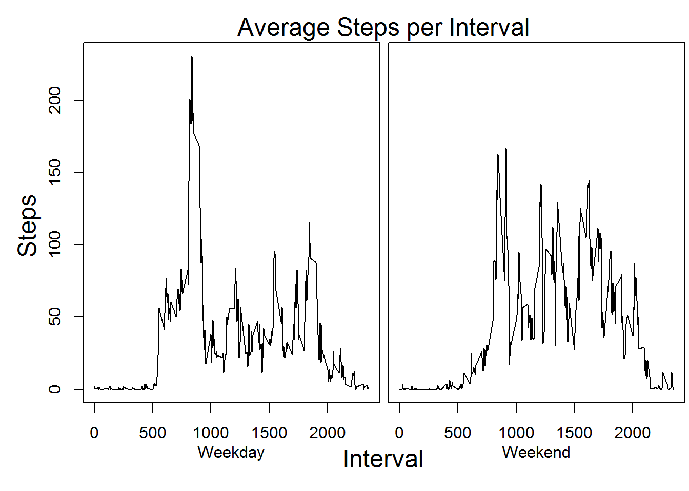

# Exploration of Activity Monitoring Data
David Harris  
Saturday, July 11, 2015  

This project explores activity data generated by a personal activity monitoring device. This device collects data at 5 minute intervals through out the day. The data consist of two months of data from an anonymous individual collected during the months of October and Nobember, 2012 and include the number of steps taken in 5 minute intervals each data.

## Loading and preprocessing the data
First we will load the data using the following code:

```r
step_data<-read.csv("activity.csv",header=TRUE)
```

A quick glimpse at the code reveals that there are values missing.


```r
head(step_data)
```

```
##   steps       date interval
## 1    NA 2012-10-01        0
## 2    NA 2012-10-01        5
## 3    NA 2012-10-01       10
## 4    NA 2012-10-01       15
## 5    NA 2012-10-01       20
## 6    NA 2012-10-01       25
```
## What is mean total number of steps taken per day?
In the instructions for this portion of the assignment we have been told that we can ignore the missing values in the dataset.
"Ignore the missing values" can be interpreted in multiple ways. One interpretation is that we proceed as if the missing values are not even noticed. A second interpretation is that we only use the measurements for which there are data. Each of these two interpretations will lead to a different outcome as demonstrated below.

###Interpretation 1: Proceed ahead while doing nothing to account for missing data
Our first task is to plot a histogram of the total number of steps taken per day. To do this, we execute the following code:

```r
#This code generates the total number of steps by day. Note that NAs are converted to 0
sum_steps_day<-aggregate(step_data$steps,list(step_data$date), FUN=sum, na.rm=TRUE)

#This code gives descriptive names to the columns of sum_steps_day
names(sum_steps_day)<-c("date","sumSteps")

#This code generates a histogram of total steps per day with zeros retained.
hist(sum_steps_day$sumSteps,main="Total Steps per Day (NA ignored)",xlab = "Total Steps per Day")
```

 

We should notice that calculating the total number of steps for days in which all measurements are "NA" results in a value of "0" for that day. This becomes important when trying to determine the mean number of steps per day. To calculate the mean and median steps per day we execute the following code:

```r
#This code generates the average number of steps per day. Note that several days have a value of 0.
#I included these data in the calculation of the average.
avg_steps_day<-mean(sum_steps_day$sumSteps, na.rm=TRUE)
sprintf("%.2f",avg_steps_day)
```

```
## [1] "9354.23"
```

```r
#This code generates the median number of steps per day, including days with 0 steps.
median_steps_day<-median(sum_steps_day$sumSteps, na.rm=TRUE)
sprintf("%.2f",median_steps_day)
```

```
## [1] "10395.00"
```
We can see that using this dataset, the mean number of steps per day is **9354.23** and the median number of steps per day is **10395.00**. Now let's see what happens when we remove the missing data.

###Interpretation 2: Missing data are removed from the calculation
To remove the missing data we use following code:

```r
#This section of code only deals with complete cases in the original step_data dataset
step_datac<-step_data[complete.cases(step_data),]
```
In this case we are only keeping those rows that have complete data.
As before we will determine the total number of steps per day and plot them in a histogram.

```r
#This code generates the total number of steps by day using complete cases
sum_steps_dayc<-aggregate(step_datac$steps,list(step_datac$date), FUN=sum, na.rm=TRUE)

names(sum_steps_dayc)<-c("date","sumSteps")

#This code makes a histogram for total steps per day with complete cases
hist(sum_steps_dayc$sumSteps, main = "Total Steps per Day (NA Removed)",xlab = "Total Steps per Day")
```

 

We can see that we have eliminated several days with zero steps.

Now to calculate the mean and median steps per day we execute the following:

```r
#This code calculates the average with complete cases
avg_steps_dayc<-mean(sum_steps_dayc$sumSteps, na.rm=TRUE)
sprintf("%.2f",avg_steps_dayc)
```

```
## [1] "10766.19"
```

```r
#This code generates the median number of steps per day with complete cases.
median_steps_dayc<-median(sum_steps_dayc$sumSteps, na.rm=TRUE)
sprintf("%.2f",median_steps_dayc)
```

```
## [1] "10765.00"
```
Now we can see that using only the complete cases the mean number of steps per day is **10766.19** and the median number of steps per day is **10765.00**. 
By including the "NA" in the original dataset we reduced the mean by ~1400 steps and the median by ~400 steps.

So on average the individuals in this study took ~ 10,000 steps per day.

## What is the average daily activity pattern?
To get a little bit higher resolution data, we want to see how the steps were distributed over the intervals of a day on average.

To do this we calculated the average steps taken per interval across all of the data and plotted these values against the intervals using the following code:

```r
#This code converts the "interval" data into a factor column
step_datac$interval<-as.factor(step_datac$interval)

#This calculates the average number of steps for each interval
interval_avgc<-aggregate(step_datac$steps,list(step_datac$interval), FUN = mean, na.rm=TRUE)

#This gives the columns of internal_avg more descriptive names
names(interval_avgc)<-c("interval","avgSteps")

#This code converta the interval column into a numeric for plotting
interval_avgc$interval<-as.numeric(levels(interval_avgc$interval))[interval_avgc$interval]

#This plots the points for the average number of steps for each interval
plot(interval_avgc$interval,interval_avgc$avgSteps, type = "l", xlab="Interval", ylab="Average Steps",main="Average Number of Steps per Interval")
```

 

From this plot we can see that there is a peak in the data in the 800 - 1000 interval range.

To determine the actual maximum interval we execute the following code:

```r
#This code returns the interval number that has the maximum average steps
max_avg<-interval_avgc[which.max(interval_avgc$avgSteps),1]
sprintf("%.2f",max_avg)
```

```
## [1] "835.00"
```
**This shows us that the maximum interval is 835.00**.

## Imputing missing values
Instead of doing nothing or just removing the missing data, let's see what happens if we impute the missing data.
In this case I will replace the missing data with the average value for the corresponding interval.`

First I will determine the number of NAs in the dataset using the following code:

```r
#First calculate the total number of NAs in the data set
sum(is.na(step_data))
```

```
## [1] 2304
```
Now I will create a duplicate dataset that has the missing values replaced with the avg value for the corresponding interval using the following code:

```r
#This creates a duplicate of the first dataset
step_datab<-step_data

#This creates a new column in the dataset that contains the average value for each interval
step_datab$interval_avg<-tapply(step_datab$steps,step_datab$interval, FUN = mean, na.rm=TRUE)

#This replaces the NA values with the average value for the given interval
step_datab[is.na(step_datab$steps),1]<-step_datab[is.na(step_datab$steps),4]

#This code removes the interval_avg column to make this dataset identical to the original except
#for the replaced NAs
step_datab$interval_avg<-NULL
```

Now that I have filled in the missing data I can perform the same analysis that I did previously to generate a histogram of total steps per day.


```r
#This code generates the total number of steps by day using complete cases
sum_steps_dayb<-aggregate(step_datab$steps,list(step_datab$date), FUN=sum, na.rm=TRUE)

names(sum_steps_dayb)<-c("date","sumSteps")

#This code makes a histogram for total steps per day with complete cases
hist(sum_steps_dayb$sumSteps, main = "Total Steps per Day (Imputed)", xlab="Total Steps per Day")
```

 

From this histogram we can see that there are ~10 more days added to the peak of the histogram.

Now let's determine the mean and median of the total steps per day using the new data set.

```r
#This code calculates the average with complete cases
avg_steps_dayb<-mean(sum_steps_dayb$sumSteps, na.rm=TRUE)
sprintf("%.2f",avg_steps_dayb)
```

```
## [1] "10766.19"
```

```r
#This code generates the median number of steps per day with complete cases.
median_steps_dayb<-median(sum_steps_dayb$sumSteps, na.rm=TRUE)
sprintf("%.2f",median_steps_dayb)
```

```
## [1] "10766.19"
```

For the imputed data we get a mean number of steps per day of **10766.19** and a median number of **10766.19**.

Hmm, our mean and median are the same. How can we have a fractional median for a value that should be an integer?
Aha! Because we used the average number of steps per interval to replace our NA values in the original data set, we "created" non-integer data!

###Did imputing the missing data make a big difference?
When we did nothing to the NA data, we simply ignored it and proceeded with our analysis, we calculated a mean total steps per day of **9354.23** and a median of **10395.00**.

When we removed the NA data we calculated a mean total steps per day of **10766.19** and a median of **10765.00**.

When we imputed the NA data we calculated a mean total steps per day of **10766.19** and a median of **10766.19**.

**From these results we can see that imputing the data was not significantly different than removing the missing data from the data set. However, removing the data or imputing the data had a large effect when compared to just leaving the NA data in**.

## Are there differences in activity patterns between weekdays and weekends?
One interesting question to explore is the difference in activity between the weekdays and the weekends. One might expect to see a difference given that most people go work on the weekdays and do more recreational activities on the weekend.

To do this we can plot the average steps per interval on weekdays and compare it to a plot of average steps per interval on the weekend.


```r
#First let's convert our interval data back into a factor
step_datab$interval<-as.factor(step_datab$interval)

#This converts the "data" column into actual R-readable dates.
step_datab$date<-levels(step_datab$date)[step_datab$date]
step_datab$date<-as.Date(step_datab$date,"%Y-%m-%d")

#This creates a new column that contains the numeric value of the weekday
step_datab$weekday<-format(step_datab$date,"%w")

#This code changes those observations that occured Mon-Friday to be labeled as "weekday"
step_datab[which(step_datab$weekday %in% c("1","2","3","4","5")),4]<-"weekday"

#This code changes those observations that occured Sat-Sun to be labeled as "weekend"
step_datab[which(step_datab$weekday %in% c("0","6")),4]<-"weekend"

#This code converts the "weekday" column into factors
step_datab$weekday<-as.factor(step_datab$weekday)

#This code calculates the mean steps per interval for weekdays or weekend
w_steps<-aggregate(step_datab$steps,list(step_datab$interval,step_datab$weekday), FUN=mean, na.rm=TRUE)

#This changes the name of the columns to be more descriptive
names(w_steps)<-c("Interval","Weekday","Steps")

#This determines the range to use for the Y-axis of the plots
rng<-range(w_steps$Steps)

#This converts the "Interval" column from factor to numeric so that we can generate a line plot
w_steps$Interval<-as.numeric(levels(w_steps$Interval))[w_steps$Interval]

par(mfrow=c(1,2),oma = c(4,4,2,0),mar = c(0.5,0.25,0.2,0.2))

plot(w_steps[w_steps$Weekday == "weekday",1],w_steps[w_steps$Weekday=="weekday",3],ylim=rng, type = "l")

plot(w_steps[w_steps$Weekday == "weekend",1],w_steps[w_steps$Weekday=="weekend",3],ylim=rng,yaxt="n", type = "l")

mtext("Average Steps per Interval", side = 3, outer = TRUE, cex = 1.5)
mtext("Steps", side = 2, outer = TRUE, cex = 1.5, line = 2)
mtext("Interval", side = 1, outer = TRUE, cex = 1.5, line = 2)
mtext("Weekday", side = 1, outer = TRUE, cex = 1, line = 1.5, at = .25)
mtext("Weekend", side = 1, outer = TRUE, cex = 1, line = 1.5, at = .75)
```

 

**From this plot we can see that the large peak in steps at interval 835 primarily occurs on the weekdays.** 

**While there is no dramatic peak in activity during the weekend, it appears that there is more activity over the course of the whole day as compared to the weekday.**
